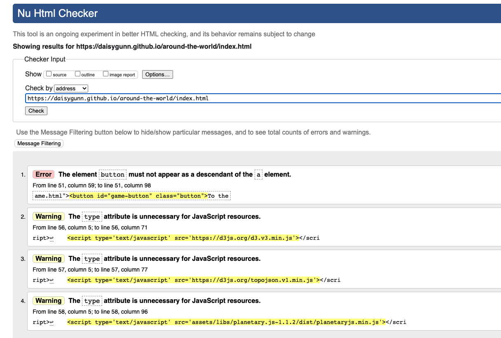

# Around The World

[View the website here](https://daisygunn.github.io/around-the-world/)

This website has been produced to provide a platform for an Educational geography game for children aged 8-12, it offers questions in a quiz format to test their knowledge of capital cities around the world. 

In addition to the home page this website also features:
- The 'Play Game' page
- A 'Rules' page
- A 'High Scores' page

The business goals of the website are:
1. To provide an educational learning platform for children.
2. To provide engaging content so that users enjoy using this quiz.
3. To create an easy to navigate website to ensure that it is user friendly.

The user goals of this website are:
1. To learn about new capital cities around the world.
2. To test my knowledge of capital cities using the quiz.
3. To improve my previous scores & therefore my overall knowledge.

--- 
## UX

### Strategy
Using the core UX principles I first started with Strategy, thinking about the target audience for this quiz & the features they would want.

The target audience for 'Around the World' are:
- Children aged 8-12
- Children interested in geography
- Children that would like to improve their geographical knowledge

Features that they would need to be included:
- A fun & interactive quiz
- The ability to track their high scores so they can see if they're improving

It was imperative to me that this website was simple & easy to use to ensure that the users had an enjoyable experience; therefore each page has a limited amount of information, written in simple language. 

As children aren't always guaranteed to have mobile phones this website has been designed to work well on desktops & tablets as well, to ensure that no matter the device the user has a positive user experience.

### Scope
To achieve the desired user and business goals this website will include the following:
1. A landing page with:
- Navigation bar
- Animated H1 element
- a H2 tagline
- An interactive 3D globe that responds to mouse movement

2. Quiz page:
- Navigation bar
- H1 element
- Start game button
- Question count & score tally
- Quiz question & answer buttons
- Quit game button

3. End of quiz page:
- H1 element
- Form to submit high score
- Control buttons

4. Rules page:
- Navigation bar
- H1 element
- Quiz rules and instructions

5. High Scores page:
- Navigation bar
- H1 element
- List of top 5 high scores

### Structure
This is a multi-page website to keep the amount of information on each page limited and easy to digest; the rules, game and high scores are all separated so that any child using the website can find what they want easily.
Each page is designed with simplicity in mind, with a responsive navbar and an H1 element and then the relevant content centred below; this simplicity will allow for users to feel comfortable using and navigating each page. The only page that differs from this layout is the end-page, I opted to have navigation buttons instead of a navbar at the top as I wanted the user to know they had to click something to move on from this page. 
The quiz itself has a question, a text input and four answer buttons - this layout of this will be responsive so that it isn't too squashed when being viewed on a smaller screen. 

### Skeleton
[View wireframes here](assets/documents/wiresframes.pdf) - please note the actual website differs slightly from these wireframes.

Whilst building the website I opted to change the type of quiz that this website would feature, I went for a capital's of the world quiz as this would allow me to dynamically create the question and answer buttons using JavaScript. 

I also decided to add a next button instead of an alert as I felt this would provide the user with a better experience, as having to click out of the alert could be annoying for some.

Furthermore, I decided to add a responsive navbar to further enhance the user experience when viewing the website on a mobile phone.

### Surface
I chose to use a background colour of 'Dodger Blue', I think blue has a direct correlation with images of the earth and our planet and it's for this reason I chose it, I also wanted something simple so as not to detract from any of the content. 
On the landing page, there is an animated globe that zooms in and out upon the mouse being scrolled, this interactive element provides something fun for the user straight away.
Using google fonts I chose Yogomi as I felt it had a childlike handwriting feel to it and this will be used for all text elements on the website.

---
## Features 

### All pages
#### *Navbar*
The navbar features on all pages & is fully responsive, on screens smaller than 768px it collapses in a hamburger icon which when clicked opens the menu with links in a vertical list. I felt this simple way of displaying the menu on all screen sizes would be intuitive and provide all users with a positive user experience.

### *Title* 
All page titles are `H1` elements, they are centred and large in size so there is no ambiguity as to which page the user is on.

### *Buttons*
All of the navigation buttons throughout the site are styled in the same way & they change once the user hovers over them; this continuity was intentional as I want all users to feel comfortable with this website & its features and be able to use it with ease.

### Home page
#### *Animated Globe*
The animated globe on the home page was added to provide a fun interactive element as soon as users entered the site, as the target audience is children I wanted to create a positive reaction instantaneously so that users would feel encouraged to continue through the site.

#### *Animated heading*
In addition to the globe I chose to animate the heading to continue that feeling of fun, I felt this would entice users over a static heading.

#### *To the Quiz button*
After asking my family to test the quiz it was highlighted to me that having a button to take you straight to the quiz might make it easier for users to navigate and so I added this button. It is styled as all of the other buttons are throughout the site.

### Rules
#### *Rules list*
The list of rules is an `ol` element, it has been styled to remain in the centre of the screen to allow for better responsivity.

### Quiz
#### *Game controls*
These buttons follow the same style rules as the other buttons, they just appear on the screen at different times depending on what the user clicks. I wanted to give the user control over the quiz process and also to be able to quit if required.

#### *Quiz elements*
The quiz is made up of the following: 
- Two progress items (question & score counts), which remain at the top of the quiz on opposite sides of the page so the user can see their progress.
- Question, this is dynamically created each time a new question is generated but always remains in the centre of the screen.
- Answer buttons, these are styled in opposite colours to the other buttons featured. They have been designed in this way to create a clear difference so that users aren't confused.

#### *Sound toggle button*
After adding the sound effects for a right/wrong answer I decided that to further enhance the user experience there should be a control for this on the page. Using a favicon mute & sound icon (that change when clicked), I added a JavaScript function to mute or unmute the sound. 

### End page
#### *Blinking title*
I wanted to animate this heading in a familiar 'game' way as I felt this would further engage the user and clearly indicate the game is over.

#### *Save score form*
For the user to save their score to the High Scores page they need to input their username and click save, this is done using a form made up of a text input and submit button. 

#### *Nav buttons*
Unlike the other pages, this page doesn't feature a navbar as I felt buttons directly under the form would indicate to the user they needed to do something to move on from this page.

### High Scores
#### *High Scores Leaderboard*
The High Scores Leaderboard is an `ul` element, it has been styled to remain in the centre of the screen to allow for better responsivity. The scores in this list are generated in `high-scores.js` using local storage.

---
## Technologies Used
I have used several technologies that have enabled this design to work:

- [HTML](https://developer.mozilla.org/en-US/docs/Web/HTML)
    - Used as the basic building block for the project and to structure the content.
- [CSS](https://developer.mozilla.org/en-US/docs/Learn/Getting_started_with_the_web/CSS_basics)
    - Used to style all the web content across the project. 
- [JavaScript](https://www.javascript.com/)
    - Used for the responsive navbar, animated heading, quiz functionality & sound effects and high-scores leaderboard.
- [Jquery](https://jquery.com/)
    - This library has been used occassionally in my JavaScript code, specifically in my checkAnswer function in quiz.js.
- [Planetary JS](http://planetaryjs.com/examples/rotating.html)
    - Library used to render the animated globe on the landing page. 
- [Google Fonts](https://fonts.google.com/)
    - Used to obtain the fonts linked in the header, fonts used were Playfair and Cookie
- [Font Awesome](https://fontawesome.com/)
    - Used to obtain the icons used on the high scores and rules pages.
- [Google Developer Tools](https://developers.google.com/web/tools/chrome-devtools)
    - Used as a primary method of fixing spacing issues, finding bugs, and testing responsiveness across the project.
- [GitHub](https://github.com/)
    - Used to store code for the project after being pushed.
- [Git](https://git-scm.com/)
    - Used for version control by utilising the Gitpod terminal to commit to Git and Push to GitHub.
- [Gitpod](https://www.gitpod.io/)
    - Used as the development environment.
- [Balsamiq](https://balsamiq.com/)
    - Used to create the wireframes for the project.
- [AutoPrefixer](https://autoprefixer.github.io/)
    - Used to parse my CSS and ass vendor prefixes.
- [Grammarly](https://www.grammarly.com/)
    - Used to fix the grammar errors across the project.
- [Unicorn Revealer](https://chrome.google.com/webstore/detail/unicorn-revealer/lmlkphhdlngaicolpmaakfmhplagoaln?hl=en-GB)
    - Used to detect overflow of elements, which allowed me to quickly debug any issues.
- [Coloors](https://coolors.co/)
    - Used to create a colour palette for the design.
- [Favicon.io](https://favicon.io/)
    - Used to create favicon's for my website
- [Color Contrast Accessibility Validator](https://color.a11y.com/)
    - Allowed me to test the colour contrast of my webpage.
- [W3C Markup Validation Service](https://validator.w3.org/) 
    - Used to validate all HTML code written and used in this webpage.
- [W3C CSS Validation Service](https://jigsaw.w3.org/css-validator/#validate_by_input)
    - Used to validate all CSS code written and used in this webpage.
- [Freeformatter CSS Beautify](https://www.freeformatter.com/css-beautifier.html)
    - Used to accurately format my CSS code.
- [Freeformatter HTML Formatter](https://www.freeformatter.com/html-formatter.html)
    - Used to accurately format my HTML code.
- [AmIResponsive](http://ami.responsivedesign.is/)
    - Used to generate responsive image used in README file.
- [Wave](https://wave.webaim.org/)
    - Used to test the accessibility of the website.
---
## Testing

### User Stories 
1. **As a first time user, I want to be able to navigate my way easily throughout the website.**
The navbar being placed right at the gives the user a clear indication of how to navigate through the website, it is placed in the same place on every page to provide continuity for the user.

2. **As a first time user, I want to learn about new capital cities around the world by playing the quiz.**
As part of the quiz design, I added both visual & sound cues so that the user will know when they have answered a question correctly. This instant feedback will allow them to learn as they play the quiz.
Furthermore, the quiz features every country in the world and so there is a vast opportunity to learn about countries they may not have known about before.

3. **As a recurring user, I want to track my scores to see if I've made the high scores leaderboard.**
Upon completing the quiz the user is taken to the end page, where they are able to save their score against their username, the top 5 scores saved to local storage are then displayed on the high scores page:

### Lighthouse
I used the Lighthouse report on Google Dev Tools to test my websites performance, accessibility and best practices, my first report has an SEO score of under 90, after adding more detailed `meta-keywords` & `meta-description` all of my scores are now above 90:

### Known bugs and fixes
Throughout the entire project, I have used Google Chrome Developer Tools to debug any issues with styling and alignment; this tool enabled me to change things and see the effect this had immediately. The use of the console whilst in dev tools was also incredibly helpful as I was able to utilise this to test my JavaScript code, using `console.log()` to check that my functions were being called correctly and that the desired information was going to be displayed. This was pivotal in designing the quiz as I needed to have access to the information of the various elements in order to be able to programme the quiz correctly.

I tested the quizzes functionality by 'playing' it myself, to ensure the user experience was positive and that everything was working as it should. One key bug that I resolved was the duplication of answer options, I had written a `do-while` loop in the generateQuestion function which I thought had fixed the problem but whilst testing I found the occasional duplication occurred. For this reason, I added two more `if` statements to the same function to prevent this from occurring. Using `console.log()` I was able to prove that this implementation worked and the bug had been resolved.

### Validation: HTML, CSS and JavaScript
Furthermore, I used Jshint to ensure that there were no errors within any of my JavaScript code, initially there were errors as you can see below:

However, I implemented all changes to ensure my code passed with no errors:

In addition to Jshint, I used Jigsaw to validate my HTML and CSS which both passed with errors initially:

Which both now pass with no errors: 

To further ensure that my website is fully accessible I used WAVE and color contrast - initially, I had some errors with mislabelling which I was able to resolve:

My background colour also failed the contrast report so I changed it to a darker shade of blue and now this report has no errors:

In addition to testing that I conducted, I got my friends, family & fellow students to test the website on their phones/laptops/tablets/desktops and provide feedback on anything they felt didn't work or look right, this enabled me to debug any issues that I might not have otherwise found.
---
## Deployment
I deployed this website by using GitPages and following the below steps:

### GitHub pages deployment

1. Log in to GitHub
2. In your Repository section, select the project repository that you want to deploy
3. In the menu located at the top of this section, click 'Settings'
4. Select 'Pages' on the left-hand menu - this is around halfway down
5. In the source section, select branch 'Master' and save
6. The page is then given a site URL which you will see above the source section, it will look like the following:

Please note it can take a while for this link to become fully active.

### Forking the GitHub Repository

If you want to make changes to your repository without affecting it, you can make a copy of it by 'Forking' it. This ensures your original repository remains unchanged.

1. Find the relevant GitHub repository
2. In the top right corner of the page, click the Fork button (under your account)
3. Your repository has now been 'Forked' and you have a copy to work on

### Cloning the GitHub Repository

Cloning your repository will allow you to download a local version of the repository to be worked on. Cloning can also be a great way to backup your work.

1. Find the relevant GitHub repository
2. Press the arrow on the Code button
3. Copy the link that is shown in the drop-down
4. Now open Gitpod & select the directory location where you would like the clone created
5. In the terminal type 'git clone' & then paste the link you copied in GitHub
6. Press enter and your local clone will be created.
---
## Credits
I have used several resources to produce this website, where code has been used found from another source this is credited as a comment within the HTML, CSS and JS files.

The following websites/articles were used for research and guidance:

[Stack Overflow](https://stackoverflow.com/)

[JavaScript do/while loop](https://www.javascripttutorial.net/javascript-do-while/)

[Object.keys](https://developer.mozilla.org/en-US/docs/Web/JavaScript/Reference/Global_Objects/Object/keys)

[Flexbox](https://css-tricks.com/snippets/css/a-guide-to-flexbox)

[Responsive Navbar](https://dev.to/devggaurav/let-s-build-a-responsive-navbar-and-hamburger-menu-using-html-css-and-javascript-4gci)

I obtained code from the following resources:

[Vanilla JavaScript quiz tutorial, used to save high scores, increment score and question count](https://www.youtube.com/watch?v=f4fB9Xg2JEY)

[Animated heading code](https://tobiasahlin.com/moving-letters/#6)

[Planetary JS, used for animated & interactive globe](http://planetaryjs.com/examples/rotating.html)

The below sources were used for content: 

[Countries and their capital cities](https://www.countries-ofthe-world.com/capitals-of-the-world.html)

[Sound effects obtained from Zapsplat](https://www.zapsplat.com)

---
## Acknowledgements

I would like to thank my course mentor Guido Cecilio for his support and guidance throughout the course of the project and my fellow students Harry Dhillon and Jack Crosbie for their support & feedback.